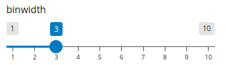

---
filters:
  - shinylive
---



## Topic 7: Creating a custom `teal` module (20 minutes)

A teal module consists of two main components, similar to a Shiny module:

1. **UI function** - defines the user interface
2. **Server function** - contains the server logic

The key difference from a standard Shiny module is that the **server function now has a `data` parameter**:

- This parameter is **reactive** and contains a `teal_data` object
- The `teal_data` object holds all the datasets available in the teal application
- Access datasets using `data()[["dataset_name"]]`

## Basic structure of a `teal_module`

```{.r code-line-numbers="1-4,6-11,13-18"}
my_module_ui <- function(id) {
  ns <- NS(id)
  # Define UI elements with proper namespacing
}

my_module_srv <- function(id, data) {
  moduleServer(id, function(input, output, session) {
    # data parameter contains reactive teal_data object
    # Access datasets: data()[["ADSL"]], data()[["ADAE"]], etc.
  })
}

# Create the module from UI and server functions
my_module <- teal::module(
  label = "Module Label",
  ui = my_module_ui,
  server = my_module_srv
)
```

## Base functionality of our custom module

Let's create a custom module that shows a **simple histogram plot** based on user selected columns.

- **UI function** should contain (wrapped in `shiny::tags$div()`):
  1. A variable selector (using `shiny::selectInput()`)
  1. A plot output (using `shiny::plotOutput()`)
- **Server** should:
  1. Update the variable selector choices based on numeric columns from the `ADSL` dataset
      - Using `shiny::updateSelectInput()` to set choices of `data()[["ADSL"]]` numeric columns
      - Helper snippet: `data()[["ADSL"]] |> dplyr::select(where(is.numeric)) |> names()`
  2. Create a histogram plot using `ggplot2` based on the selected variable (Using `ggplot2::geom_histogram()`)
      - Helper snippet: `ggplot(ADSL, aes(x = selected_variable)) + geom_histogram()`

ℹ️ Good to know:

- Use `teal.code::within()` to create reproducible code inside reactive expression and return it at the end.
- `teal_data` code is not aware of shiny inputs
  - Use named parameters in `within()` to pass shiny inputs


## Initial teal module code

> See `topic_7/exercise_7.R` for the code to start with

```{.r}

```

::: {.callout-tip collapse="true"}
### Example App

```{shinylive-r}
#| standalone: true
#| viewerHeight: 680

```
:::

## 🛠️ Exercise

Let's enhance the module:

-   Let's create a new parameter `binwidth`:

    

    -   add a new widget to the UI
        -   that widget may be created with `shiny::sliderInput()`
        -   make reasonable values of `min`, `max`, `step` and initial `value`

    -   read and use that widget in server
        -   pass this parameter value as `binwidth` argument to the `geom_histogram()` function

    ::: {.callout-tip collapse="true"}

    ## Answer

    ```{.r code-line-numbers="1-9"}
    my_custom_module_ui <- function(id) {
      # ... existing code ...
      tags$div(
        # ... existing code ...,
        sliderInput(
          inputId = ns("binwidth"),
          label = "binwidth",
          min = 1,
          max = 10,
          step = 1,
          value = 3
        ),
        # ... existing code ...
      )
    }
    ```

    ```{.r}
    my_custom_module_srv <- function(id, data) {
      moduleServer(id, function(input, output, session) {

        # ... existing code ...

        # add plot call to qenv
        result <- reactive({
          req(input$variable)
          within(
            data(),
            {
              plot <- ggplot(ADSL, aes(x = input_var)) +
                geom_histogram(binwidth = input_binwidth)
              plot
            },
            input_var = as.name(input$variable), # Pass the selected variable as a symbol
            input_binwidth = input$binwidth
          )
        })

        # ... existing code ...

      })
    }
    ```
    :::
-   Let's see how we can add a heading to the reporter

    -   Use `teal.reporter::teal_card` to get and modify the reporter card
        -   `teal.reporter::teal_card(x)` accesses the current card
        -   `teal.reporter::teal_card(x) <- c(...)` modifies the current card
            -   inside `c(...)` you can merge existing card content with new elements
    -   Add a title to the card using using a markdown string
    -   Evaluate the code that generates the histogram

    ::: {.callout-tip collapse="true"}

    ## Answer

    ```{.r}
    reactive({
      q <- data()
      teal.reporter::teal_card(q) <- c(
        teal.reporter::teal_card(q),
        "### Histogram of Selected Variable"
      )
      within(
        q,
        {
          plot <- ggplot(ADSL, aes(x = input_var)) + geom_histogram()
          plot
        },
        input_var = as.name(input$variable) # Pass the selected variable as a symbol
      )
    })
    ```
    :::

## 🛠️ Bonus Exercise _(add more datasets)_

-   Let's add more datasets

    -   extend `data` with `ADAE = teal.pharmaverse::adae`
    -   add a new widget in the UI
        -   that widget should be created with `shiny::selectInput()`
        -   initialize empty and update values in the same way as for `input$variable`
    -   read and use in the server
        -   modify the variable selection - it has to be chosen from the currently selected dataset
            -   convert to `observeEvent()` on `input$dataset`
            -   add at the beggining: `req(input$dataset)` to assure non empty selection
            -   modify to `choices = names(data()[[input$dataset]])`
        -   modify the observer call
            -   add `req(input$dataset)`
            -   add `req(input$variables %in% names(data()[[input$dataset]]))`
        -   modify ggplot call
            -   convert the value to a symbol and use as a first argument of `ggplot()`

    ::: {.callout-tip collapse="true"}

    ## Answer

    ```{r, eval = FALSE}
    data <- within(data, {
      ADSL <- pharmaverseadam::adsl
      ADAE <- pharmaverseadam::adae
    })
    ```

    ```{r, eval = FALSE}
    my_custom_module_ui <- function(id) {
      ns <- NS(id)
      tags$div(
        # dataset selector
        selectInput(
          inputId = ns("dataset"),
          label = "Select dataset",
          choices = NULL
        ),
        # ... existing code ...
      )
    }
    ```

    ```{r, eval = FALSE}
    my_custom_module_srv <- function(id, data) {
      moduleServer(id, function(input, output, session) {

        # ... existing code ...

        updateSelectInput(
          inputId = "dataset",
          choices = names(data())
        )

        observeEvent(
          input$dataset,
          {
            req(input$dataset)
            updateSelectInput(
              inputId = "variable",
              choices = data()[[input$dataset]] |> select(where(is.numeric)) |> names()
            )
          }
        )

        # Update reactive and render function
        result <- reactive({
          req(input$dataset)
          req(input$variable)
          within(
            data(),
            {
              my_plot <- ggplot(input_dataset, aes(x = input_var)) +
                geom_histogram()
              my_plot
            },
            input_dataset = as.name(input$dataset),
            input_var = as.name(input$variable)
          )
        })

        output$plot <- renderPlot({
          result()[["my_plot"]]
        })

      })
    }
    ```
    :::

<!--

### 🛠️ Exercise (bonus)

-   Convert module to a function and let `label` be a function parameter.

-->

## 📚 What did we learn?

- How to create a custom teal module
- How to interact with `teal_data` object in the module server
- How to enable reproducible code and reporting features

## 🌐 References

-   [`teal::module()`](https://insightsengineering.github.io/teal/latest-tag/reference/teal_modules.html)
-   ["Creating Custom Modules"](https://insightsengineering.github.io/teal/latest-tag/articles/creating-custom-modules.html) vignette
-   [`"qenv"`](https://insightsengineering.github.io/teal.code/latest-tag/articles/qenv.html) article on how to interact with internal `qenv` object - in particular: [`teal.code::within()`](https://insightsengineering.github.io/teal.code/latest-tag/reference/qenv.html) function
